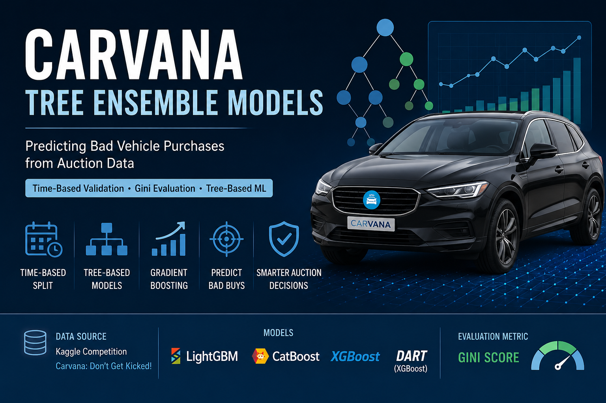
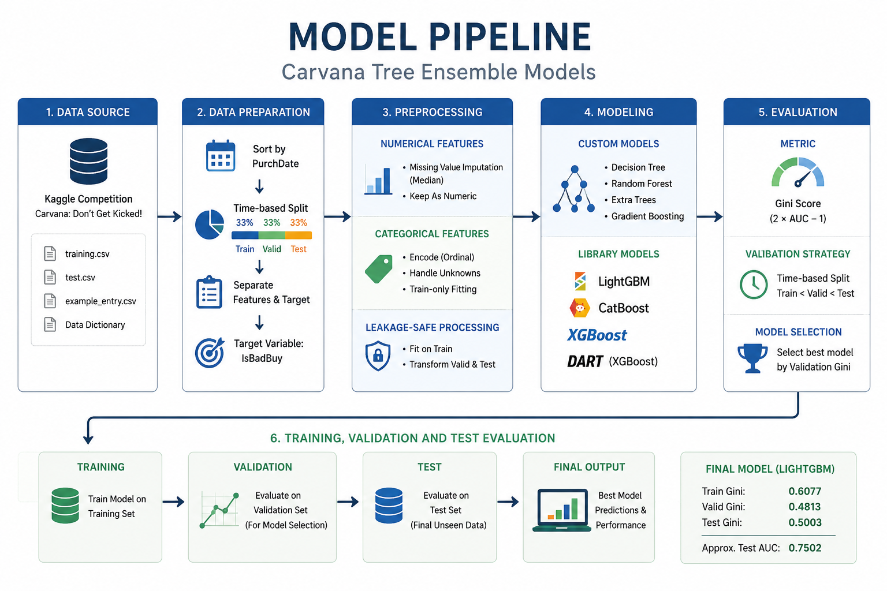

# Carvana Tree Ensemble Models


     



## Overview

This project is a tree-based machine learning case study for predicting bad vehicle purchases using auction data from the Kaggle competition **Carvana: Don't Get Kicked!**.

The goal is to predict whether a purchased vehicle is likely to become a bad buy using historical auction records, vehicle characteristics, market reference prices, warranty cost, and purchase information.

The project combines custom implementations of decision-tree-based algorithms with modern gradient boosting libraries such as LightGBM, CatBoost, and XGBoost.

## Model Pipeline



## Business Objective

Vehicle auction purchases involve financial risk. Some vehicles may later become bad buys due to quality issues, warranty costs, poor resale potential, or hidden defects.

This project builds a machine learning workflow that estimates the probability that a vehicle belongs to the bad-buy class.

The target variable is:

```text
IsBadBuy
```

This is a binary classification problem:

```text
0 = not a bad buy
1 = bad buy
```

## Dataset

The dataset comes from the Kaggle competition:

```text
https://www.kaggle.com/competitions/DontGetKicked
```

The data contains vehicle auction records with fields such as:

```text
Purchase date
Auction provider
Vehicle year
Vehicle age
Manufacturer
Model
Trim
Color
Transmission
Odometer reading
Vehicle cost
Market reference prices
Warranty cost
Online sale flag
Bad-buy target
```

The full CSV dataset is not stored directly in this repository. Dataset access instructions are available in:

```text
data/README.md
```

The data dictionary is included in:

```text
data/Carvana_Data_Dictionary.txt
```

## Validation Strategy

The project uses a time-based train, validation, and test split based on the `PurchDate` field.

The data is sorted by purchase date and split as follows:

```text
First 33% of records  -> training set
Middle 33% of records -> validation set
Last 33% of records   -> test set
```

This ensures:

```text
train.PurchDate < valid.PurchDate < test.PurchDate
```

This setup is more realistic than a random split because the model is trained on historical purchases and evaluated on later purchases.

## Evaluation Metric

The main metric is the Gini score.

```text
Gini = 2 × AUC - 1
```

Gini measures how well the model ranks risky vehicles above safer vehicles.

A higher Gini score indicates stronger separation between bad-buy and non-bad-buy vehicles.

## Modeling Approach

The notebook includes custom implementations of tree-based algorithms and comparisons with optimized libraries.

Custom models include:

```text
Decision Tree Classifier
Decision Tree Regressor
Random Forest Classifier
Extra Randomized Trees
Gradient Boosting Decision Trees
```

Library-based models include:

```text
scikit-learn DecisionTreeClassifier
LightGBM
CatBoost
XGBoost
XGBoost DART
```

## Final Results

The best model selected by validation Gini is:

```text
LightGBM
```

Final reported scores:

```text
Train Gini:      0.6077
Validation Gini: 0.4813
Test Gini:       0.5003
```

Approximate AUC values:

```text
Train AUC:      0.8039
Validation AUC: 0.7407
Test AUC:       0.7502
```

The test Gini is slightly higher than the validation Gini, which suggests stable generalization to the later time-based test period.

## Model Comparison

Representative validation Gini scores from the notebook:

```text
Custom Decision Tree:      0.4509
Custom Random Forest:      0.4582
Custom GBDT:               0.4629
Custom Extra Trees:        0.4648
LightGBM:                  0.4813
CatBoost:                  0.4805
XGBoost DART:              0.4798
```

Gradient boosting models provided the strongest validation performance, with LightGBM achieving the best validation Gini in this workflow.

## Documentation

Additional documentation is available in:

```text
data/README.md
docs/project_overview.md
docs/dataset_description.md
docs/modeling_approach.md
docs/evaluation.md
reports/model_summary.md
```

## Skills Demonstrated

This project demonstrates practical skills in:

```text
Tabular machine learning
Binary classification
Decision tree implementation
Random Forest implementation
Extra Trees implementation
Gradient Boosting implementation
LightGBM
CatBoost
XGBoost
Temporal validation
Leakage-safe preprocessing
Gini-based evaluation
Model comparison
Model interpretation
```

## Tools and Technologies

```text
Python
NumPy
pandas
scikit-learn
LightGBM
CatBoost
XGBoost
matplotlib
seaborn
Jupyter Notebook
Kaggle
Git
GitHub
```

## Project Value

This repository presents a complete tree-based machine learning workflow for a real-world tabular classification problem.

It demonstrates both algorithmic understanding through custom implementations and practical model development through modern gradient boosting libraries.

## Author

Luis Fernando Avalos Guzman

GitHub: [Luis99fer](https://github.com/Luis99fer)

## License

This project is licensed under the MIT License.